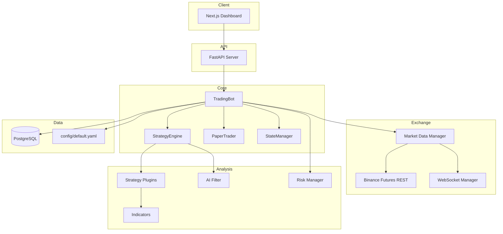

# AIBotTrade

Production-ready Binance Futures trading bot with plugin strategies, backtesting, AI signal filtering, risk management, and a real-time dashboard.

## Features

- **Exchange**: Binance Futures (Testnet + Live), Hedge Mode, Market/Limit orders, WebSocket candles, rate limiting, auto-reconnect
- **Market Data**: Multi-symbol, multi-timeframe (1m–4h), order book, funding rate, open interest
- **Indicators**: EMA, SMA, RSI, MACD, ATR, ADX, VWAP, Bollinger Bands, Supertrend, Volume Profile, Support/Resistance
- **Strategies**: EMA Cross + RSI, Trend Following, Scalping, Breakout, Mean Reversion (YAML enable/disable)
- **AI Filter**: Optional ML trade approval using trend, momentum, volume, funding, OI features
- **Risk**: Position sizing, ATR stops, trailing stop, break-even, daily loss cap, drawdown limit, cooldown — see [docs/RISK_PROTECTION.md](docs/RISK_PROTECTION.md) for the dashboard guide
- **Backtesting**: Win rate, profit factor, Sharpe, max drawdown, CAGR, expectancy, monthly returns, charts
- **Paper Trading**: Simulated trading identical to live mode
- **Dashboard**: FastAPI + Next.js with live balance, positions, trades, equity curve, signals, logs, manual controls
- **Notifications**: Telegram for entries, exits, errors, daily/weekly reports
- **Database**: PostgreSQL with Alembic migrations

## Architecture



## Folder Structure

```
aibottrade/
├── api/                    # FastAPI routes and schemas
│   ├── app.py
│   ├── routes/
│   └── schemas/
├── core/                   # Bot orchestration
│   ├── bot.py
│   ├── engine.py
│   ├── main.py
│   ├── paper_trader.py
│   └── state.py
├── exchange/               # Binance connectivity
│   ├── binance_futures.py
│   ├── market_data.py
│   ├── websocket_manager.py
│   └── rate_limiter.py
├── strategies/             # Plugin strategies
│   ├── base.py
│   ├── registry.py
│   └── *.py
├── indicators/             # Technical analysis
├── risk/                   # Risk management
├── ai/                     # ML signal filter
├── backtest/               # Backtesting engine
├── database/               # SQLAlchemy models + repos
├── notifications/          # Telegram
├── dashboard/frontend/     # Next.js UI
├── utils/                  # Config, logging, helpers
├── tests/                  # Unit tests
├── config/default.yaml     # Trading configuration
├── alembic/                # DB migrations
├── Dockerfile
├── docker-compose.yml
└── pyproject.toml
```

## Quick Start

### Prerequisites

- Python 3.12+
- Node.js 20+ (for dashboard)
- PostgreSQL 16+ (or use Docker)

### 1. Clone and configure

```bash
git clone <repo-url> aibottrade
cd aibottrade
cp .env.example .env
# Edit .env with your API keys (never commit .env)
```

### 2. Install Python dependencies

```bash
python -m venv .venv
source .venv/bin/activate  # Windows: .venv\Scripts\activate
pip install -r requirements.txt -r requirements-dev.txt
```

### 3. Database setup

```bash
# Start PostgreSQL (or use docker-compose)
docker compose up -d postgres
alembic upgrade head
```

### 4. Run in paper mode (default)

```bash
python -m core.main run
```

### 5. Start API + Dashboard

```bash
# Terminal 1: API
python -m core.main api

# Terminal 2: Dashboard
cd dashboard/frontend
npm install
npm run dev
```

Open http://localhost:3000

## Multi-account trading

- **Start** — begins auto-trading on one account (others can run in parallel).
- **Stop** — stops auto-trading for that account only (per-account row in the dashboard).
- **Stop All Accounts** — stops every account and the engine.
- **View** — switch dashboard focus (risk limits, balance) without starting trading.

Risk limits are **per account** (`data/accounts/{id}_risk.json`). See [docs/RISK_PROTECTION.md](docs/RISK_PROTECTION.md).

## Docker Deployment

### Local (PostgreSQL in Docker)

```bash
cp .env.example .env
# Edit .env — keys, TRADING_MODE, etc.
docker compose up -d --build
```

Services:
- **postgres**: port 5432
- **bot** (API): port 8000
- **frontend**: port 3000

### AWS with RDS (recommended for production)

1. Create **RDS PostgreSQL** (`db.t4g.micro` or larger) in the same VPC as your EC2.
2. Security group: allow EC2 → RDS on port **5432** only (not public internet).
3. On EC2:

```bash
cp .env.rds.example .env
# Set DATABASE_URL / DATABASE_SYNC_URL to your RDS endpoint
# Set NEXT_PUBLIC_API_URL and API_CORS_ORIGINS to your server IP or domain
docker compose -f docker-compose.rds.yml up -d --build
```

`docker-compose.rds.yml` runs **bot + frontend only** — no bundled Postgres. Migrations run automatically on startup.

Open http://your-server:3000

## Configuration

All trading parameters are in `config/default.yaml`:

```yaml
symbols:
  - BTCUSDT
  - ETHUSDT

strategies:
  ema_cross_rsi:
    enabled: true
  trend_following:
    enabled: true
  scalping:
    enabled: false

risk:
  risk_per_trade_pct: 1.0
  max_daily_loss_pct: 3.0
  max_drawdown_pct: 10.0
```

Override secrets via `.env` (API keys, database URL, Telegram tokens).

## Trading Modes

| Mode | `.env` value | Description |
|------|-------------|-------------|
| Paper | `TRADING_MODE=paper` | Simulated trading (default) |
| Testnet | `TRADING_MODE=testnet` | Binance Futures testnet |
| Live | `TRADING_MODE=live` | Real trading (use with caution) |

## Backtesting

```bash
python -m core.main backtest --symbol BTCUSDT --timeframe 15m
```

Outputs metrics and saves charts to `backtest_output/`.

## Strategy Documentation

### EMA Cross + RSI
Fast/slow EMA crossover with RSI filter. Long when fast crosses above slow and RSI > 40. Short on bearish cross with RSI < 60.

### Trend Following
Trades in direction of EMA(50) when ADX > 25 and Supertrend confirms direction.

### Scalping
Short-term EMA cross with Bollinger Band touches and volume confirmation. Best on 1m/5m timeframes.

### Breakout
Enters on price breaking N-period high/low with volume spike above 1.5x average.

### Mean Reversion
Fades extremes at Bollinger Bands when RSI is oversold/overbought and ADX < 20 (ranging market).

## API Endpoints

| Method | Path | Description |
|--------|------|-------------|
| GET | `/api/v1/status` | Bot status |
| GET | `/api/v1/performance` | Performance metrics |
| GET | `/api/v1/trades/open` | Open trades |
| GET | `/api/v1/trades/closed` | Closed trades |
| GET | `/api/v1/positions` | Open positions |
| GET | `/api/v1/signals` | Recent signals |
| GET | `/api/v1/logs` | Application logs |
| POST | `/api/v1/controls/trade` | Manual trade |
| POST | `/api/v1/controls/start` | Start bot |
| POST | `/api/v1/controls/stop` | Stop bot |

## Development

```bash
# Format
black .
ruff check --fix .

# Type check
mypy api core exchange strategies indicators risk ai backtest database notifications utils

# Tests
pytest tests/ -v
```

## Security

- Never hardcode API keys — use `.env`
- `.env` is gitignored
- Input validation on all API endpoints
- Bot state persisted for crash recovery
- Rate limiting on exchange API calls

## License

MIT
